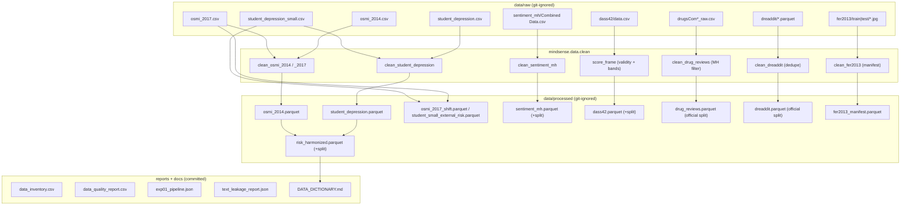

# Data Dictionary

> Generated by `python scripts/run_pipeline.py` — do not edit by hand;
> update `DICTIONARY_SPEC` in `src/mindsense/data/pipeline.py` instead.

All processed tables live in `data/processed/` (git-ignored; licences prohibit redistribution for several sources) and are regenerated by `make data`. Rows carry `data_source = real|synthetic`. Raw sources, hashes and licences: `reports/tables/data_inventory.csv`.

## `data/processed/risk_harmonized.parquet`

| Column | Type / range | Description | Source | Transformation |
|---|---|---|---|---|
| `record_id` | str | synthetic '<source>_<row>' id | pipeline | not present in raw data |
| `source` | category | originating dataset key | pipeline | provenance |
| `population` | category student/professional | source population | derived | constant per source |
| `age` | float 15-100 | respondent age (years) | Student/OSMI | invalid ages dropped at clean stage |
| `gender` | category male/female/other | gender | Student/OSMI | 49 free-text spellings normalised |
| `sleep_hours` | float 4-9 | nightly sleep bucket midpoint | Student | 'Others' -> NaN; NaN for professionals |
| `stress_pressure_score` | float 0-5 | academic pressure (student) / work-interfere rank scaled (professional) | Student/OSMI | rank Never<Rarely<Sometimes<Often scaled to 0-5 |
| `satisfaction_score` | float 0-5 | study satisfaction | Student | NaN for professionals |
| `work_study_hours` | float 0-13 | daily work/study hours | Student | NaN for professionals |
| `financial_stress` | float 1-5 | financial stress rating | Student | non-numeric -> NaN; NaN for professionals |
| `family_history` | Int64 0/1 | family history of mental illness | Student/OSMI | Yes/No -> 1/0 |
| `support_available` | float 0-1 | employer benefits + care-option awareness mean | OSMI | {Yes:1, Don't know/Not sure:0.5, No:0}; NaN for students |
| `diet_quality` | Int64 0-2 | 0 unhealthy .. 2 healthy | Student | 'Others' -> NaN; NaN for professionals |
| `suicidal_thoughts` | Int64 0/1 | ablation-only sensitive field | Student | excluded from deployed model; NaN for professionals |
| `mh_risk` | int 0/1 | PROXY target: student Depression label / professional ever-sought-treatment | Student/OSMI | not a diagnosis |
| `data_source` | category real/synthetic | provenance tag | pipeline | set by acquisition ladder |
| `split` | category train/val/test | stratified 70/15/15 by mh_risk x population | pipeline | seed 42 |

## `data/processed/dass42.parquet`

| Column | Type / range | Description | Source | Transformation |
|---|---|---|---|---|
| `age` | float 10-100 | respondent age | Open Psychometrics | impossible ages dropped |
| `gender` | category male/female/other | gender | Open Psychometrics | 1/2/3 codes mapped |
| `education` | int 1-4 | highest education level | Open Psychometrics | 1 < HS .. 4 graduate |
| `urban` | int 1-3 | childhood area rural->urban | Open Psychometrics | as collected |
| `country` | str | ISO country code of connection | Open Psychometrics | as collected |
| `data_source` | category real/synthetic | provenance tag | pipeline | real for the official release |
| `depression_score` | int 0-42 | DASS depression subscale | derived | raw sum of 14 items after 0-3 recode (no x2) |
| `anxiety_score` | int 0-42 | DASS anxiety subscale | derived | raw sum of 14 items |
| `stress_score` | int 0-42 | DASS stress subscale | derived | raw sum of 14 items |
| `*_band` | category Normal..Extremely severe | severity band | derived | Lovibond & Lovibond cut-offs |
| `Q1A..Q42A` | int 0-3 | individual item response | Open Psychometrics | 1-4 -> 0-3 recode |
| `split` | category train/val/test | stratified by depression_band | pipeline | seed 42 |

## `data/processed/sentiment_mh.parquet`

| Column | Type / range | Description | Source | Transformation |
|---|---|---|---|---|
| `text` | str | original statement | Kaggle sentiment_mh | trimmed only |
| `text_norm` | str | normalised statement | pipeline | HTML unescape, URL/handle strip, emoji->token, lowercase |
| `label` | category (7) | Normal/Depression/Suicidal/Anxiety/Bipolar/Stress/Personality disorder | Kaggle | original status labels |
| `data_source` | category real/synthetic | provenance tag | pipeline | real |
| `split` | category train/val/test | stratified 70/15/15 by label | pipeline | seed 42; split AFTER dedup |

## `data/processed/drug_reviews.parquet`

| Column | Type / range | Description | Source | Transformation |
|---|---|---|---|---|
| `uniqueID` | int | source row id | UCI/Kaggle mirror | as collected |
| `drugName` | str | brand name | UCI | as collected |
| `condition` | str | verbatim condition | UCI | as collected (incl. 'Bipolar Disorde' typo) |
| `condition_group` | category depression/anxiety/bipolar/insomnia/adhd/ocd/ptsd | mental-health group | derived | keyword match; other conditions dropped |
| `text` | str | review body | UCI | HTML entities unescaped, quotes stripped |
| `text_norm` | str | normalised review | pipeline | same recipe as sentiment_mh |
| `rating` | float 1-10 | patient rating | UCI | as collected |
| `date` | str | review date | UCI | as collected (DD-Mon-YY) |
| `usefulCount` | int | helpfulness votes | UCI | as collected |
| `split` | category train/test | official source split | UCI | preserved, not re-stratified |
| `data_source` | category real/synthetic | provenance tag | pipeline | real |

## `data/processed/dreaddit.parquet`

| Column | Type / range | Description | Source | Transformation |
|---|---|---|---|---|
| `subreddit` | str | source subreddit | Dreaddit (HF) | as collected |
| `text` | str | original Reddit post | Dreaddit | trimmed |
| `text_norm` | str | normalised post | pipeline | same recipe as sentiment_mh |
| `label` | int 0/1 | stress-related label | Dreaddit | Turcan & McKeown 2019 |
| `confidence` | float | annotator confidence | Dreaddit | as collected |
| `split` | category train/test | official source split | Dreaddit | preserved; cross-split dupes removed |
| `data_source` | category real/synthetic | provenance tag | pipeline | real |

## `data/processed/student_depression.parquet`

| Column | Type / range | Description | Source | Transformation |
|---|---|---|---|---|
| `record_id` | int | source row id | Kaggle | as collected |
| `gender` | category male/female/other | gender | Kaggle | case-normalised |
| `age` | float 12-100 | age in years | Kaggle | impossible ages dropped |
| `city` | str | city | Kaggle | kept for EDA only (high cardinality, not a model feature) |
| `profession` | str | occupation | Kaggle | kept for EDA only |
| `academic_pressure` | int 0-5 | self-rated academic pressure | Kaggle | becomes stress_pressure_score |
| `work_pressure` | int | work pressure | Kaggle | near-constant 0 - dropped when modeling |
| `cgpa` | float | CGPA | Kaggle | as collected |
| `study_satisfaction` | int 0-5 | study satisfaction | Kaggle | becomes satisfaction_score |
| `job_satisfaction` | int | job satisfaction | Kaggle | near-constant 0 - dropped when modeling |
| `sleep_hours` | float 4-9 | sleep bucket midpoint | Kaggle | 'Others' -> NaN |
| `diet_quality` | Int64 0-2 | 0 unhealthy .. 2 healthy | Kaggle | 'Others' -> NaN |
| `degree` | str | degree pursued | Kaggle | EDA only |
| `suicidal_thoughts` | Int64 0/1 | suicidal ideation history | Kaggle | ablation-only field |
| `work_study_hours` | float 0-13 | daily hours | Kaggle | as collected |
| `financial_stress` | float 1-5 | financial stress | Kaggle | non-numeric -> NaN |
| `family_history` | Int64 0/1 | family history | Kaggle | Yes/No -> 1/0 |
| `depression` | int 0/1 | TARGET label | Kaggle | dataset's labelling, not a clinical diagnosis |
| `population` | category student | population tag | pipeline | constant |
| `data_source` | category real/synthetic | provenance tag | pipeline | real |

## `data/processed/student_depression_small.parquet`

| Column | Type / range | Description | Source | Transformation |
|---|---|---|---|---|
| `gender` | category male/female/other | gender | Kaggle Tier C | case-normalised |
| `age` | float 12-100 | age in years | Kaggle Tier C | impossible ages dropped |
| `academic_pressure` | int 0-5 | self-rated academic pressure | Kaggle Tier C | as collected |
| `study_satisfaction` | int 0-5 | study satisfaction | Kaggle Tier C | as collected |
| `sleep_hours` | float 4-9 | sleep bucket midpoint | Kaggle Tier C | 'Others' -> NaN |
| `diet_quality` | Int64 0-2 | 0 unhealthy .. 2 healthy | Kaggle Tier C | 'Others' -> NaN |
| `suicidal_thoughts` | Int64 0/1 | suicidal ideation history | Kaggle Tier C | ablation-only field |
| `work_study_hours` | float | daily study hours ('Study Hours' renamed) | Kaggle Tier C | as collected |
| `financial_stress` | float 1-5 | financial stress | Kaggle Tier C | non-numeric -> NaN |
| `family_history` | Int64 0/1 | family history | Kaggle Tier C | Yes/No -> 1/0 |
| `depression` | int 0/1 | TARGET label (Yes/No strings recoded) | Kaggle Tier C | dataset's labelling, not a clinical diagnosis |
| `population` | category student | population tag | pipeline | constant |
| `data_source` | category real/synthetic | provenance tag | pipeline | real |

## `data/processed/osmi_2014.parquet`

| Column | Type / range | Description | Source | Transformation |
|---|---|---|---|---|
| `age` | float 15-100 | age in years | OSMI 2014 | impossible ages dropped |
| `gender` | category male/female/other | gender | OSMI 2014 | free-text normalised |
| `country` | str | country | OSMI 2014 | as collected |
| `state` | str | US state | OSMI 2014 | as collected |
| `treatment` | Int64 0/1 | ever sought treatment | OSMI 2014 | becomes mh_risk for professionals |
| `family_history` | Int64 0/1 | family history | OSMI 2014 | Yes/No -> 1/0 |
| `work_interfere` | category Never/Rarely/Sometimes/Often/Not applicable | work interference | OSMI 2014 | NaN -> Not applicable |
| `benefits` | category Yes/No/Don't know | employer MH benefits | OSMI 2014 | feeds support_available |
| `care_options` | category Yes/No/Not sure | care-option awareness | OSMI 2014 | feeds support_available |
| `self_employed` | category Yes/No | self employment | OSMI 2014 | as collected |
| `no_employees` | str | company size band | OSMI 2014 | as collected |
| `leave` | category | ease of MH leave | OSMI 2014 | as collected |
| `source_dataset` | category osmi_2014/osmi_2017 | survey wave | pipeline | provenance |
| `data_source` | category real/synthetic | provenance tag | pipeline | real |

## `data/processed/osmi_2017.parquet`

| Column | Type / range | Description | Source | Transformation |
|---|---|---|---|---|
| `current_disorder` | category Yes/No | self-reported current disorder | OSMI 2017 | long wording mapped to short names |
| `diagnosed_disorder` | category Yes/No | ever diagnosed | OSMI 2017 | long wording mapped to short names |
| `(other columns)` | as osmi_2014.parquet | OSMI 2017 | same tidy schema after rename |  |

## `data/processed/osmi_2017_shift.parquet`

| Column | Type / range | Description | Source | Transformation |
|---|---|---|---|---|
| `(columns)` | as risk_harmonized.parquet | OSMI 2017 | harmonized external table, Exp 6 temporal-shift evaluation only |  |

## `data/processed/student_small_external_risk.parquet`

| Column | Type / range | Description | Source | Transformation |
|---|---|---|---|---|
| `(columns)` | as risk_harmonized.parquet | Kaggle Tier C | harmonized external table, Exp 6 sanity check only |  |

## `data/processed/fer2013_manifest.parquet`

| Column | Type / range | Description | Source | Transformation |
|---|---|---|---|---|
| `path` | str | relative path to 48x48 JPG | FER2013 (Kaggle) | repo-relative for loaders |
| `emotion` | category (7) | angry/disgust/fear/happy/sad/surprise/neutral | FER2013 | folder name |
| `split` | category train/test | official split | FER2013 | preserved |
| `data_source` | category real/synthetic | provenance tag | pipeline | real for the Kaggle release |

## Data lineage

